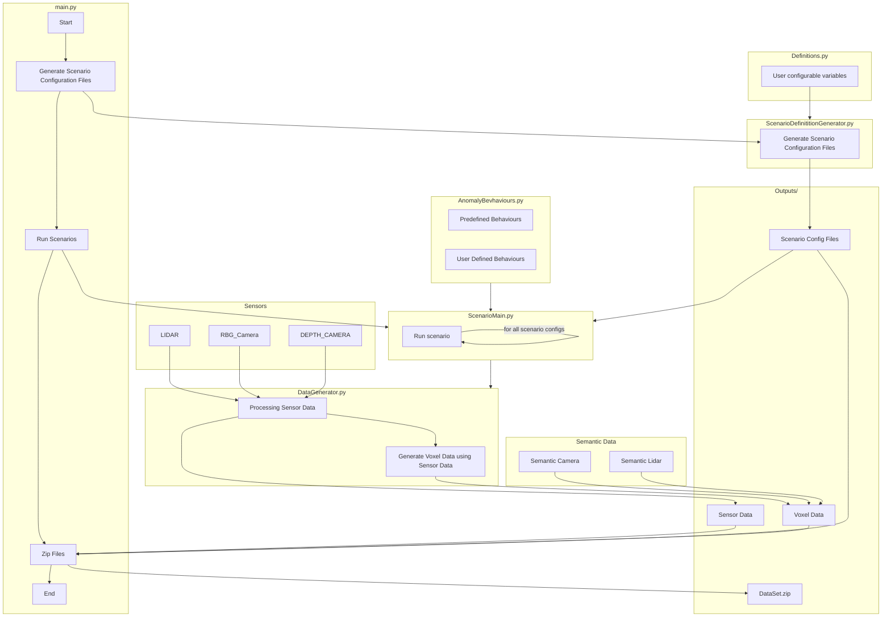

# AnoVox

A multimodal benchmark for anomaly detection in autonomous driving.

AnoVox delivers a methodology for generating datasets using the CARLA simulator. AnoVox focuses on creating datasets of
abnormal scenarios
with rare objects and unusual, unexpected actor behaviors. AnoVox is highly customizable and can be used to create new
datasets, e.g., with
adapted sensor configurations. Ground truth is provided not only in semantic camera and lidar data but also in spatial
voxel representations
in order to compare anomaly detection methods based on different sensor modalities.

[](https://www.youtube.com/watch?v=-d9NDQ43I_Q)


## Prerequisites

1. Download our [custom CARLA 0.9.14 build](https://drive.google.com/file/d/1CS8gKbU_4Lw02qJ0VYnsZTZFF7aX9WHt/view) (Linux only)
   which has all the necessary assets included
2. You need a linux distribution with git, python3, and pip installed. Tested on Ubuntu 20.04 LTS.
3. Setup a [venv](https://packaging.python.org/guides/installing-using-pip-and-virtual-environments/)
   with `python3 -m venv env`
4. Source the virtual environment with `source env/bin/activate`
5. Update pip with `pip install --upgrade pip` and install all necessary [packages](https://pypi.org/)
   with `pip install -r requirements.txt`

## Scenarios

The number of scenarios can be customized in [Definitions.py](/Definitions.py) using the following
parameters:

```python
NBR_OF_SCENARIOS = 1000
"""Number of Scenarios in the desired dataset. Set as you wish."""

USED_MAPS = [
    # "Town01",
    # "Town02",
    # "Town03",
    # "Town04",
    # "Town05",
    # "Town06",
    # "Town07",
    "Town10HD",
]
"""
Towns to be used in the dataset.
Uncomment every Map that should be used in the dataset.

Warning: Do not uncomment more towns than the value of NBR_OF_SCENARIOS.
"""
```

In the first step, AnoVox generates one scenario configuration JSON file for every used map. The config for each
scenario looks as follows:

```json
{
  "scenario_definition": {
    "map": "Town10HD",
    "scenarios": [
      {
        "anomaly_config": {
          "anomalytype": "STATIC",
          "anomaly_bp_name": "static.prop.o_barbedwire_special",
          "distance_to_waypoint": 78,
          "rotation": 237.30526616506287
        },
        "id": "739b5ee1-e1e9-43d7-93e5-b3097de8dc6e",
        "ego_spawnpoint": {
          "location": {
            "x": -110.9637451171875,
            "y": 59.68935775756836,
            "z": 0.5999999642372131
          },
          "rotation": {
            "pitch": 0.0,
            "yaw": 90.6422348022461,
            "roll": 0.0
          }
        },
        "ego_end_spawnpoint": {
          "location": {
            "x": -71.26968383789062,
            "y": 132.3148956298828,
            "z": 0.5999999642372131
          },
          "rotation": {
            "pitch": 0.0,
            "yaw": -167.12705993652344,
            "roll": 0.0
          }
        },
        "ego_route": {
          "locations": [
            {
              "x": -110.9571762084961,
              "y": 63.85898971557617,
              "z": 0.0
            },
            {
              "x": -110.9683837890625,
              "y": 64.85892486572266,
              "z": 0.0
            }
          ],
           "weather_preset": "SOFT_RAIN_SUNSET",
           "npc_vehicle_amount": 100, 
           "npc_walker_amount": 50
        }
      }
    ]
  }
}
```

The following attributes are randomized:

- weather
- spawn point of the ego vehicle
- anomaly actor/object
- spawn point of the anomaly (depending on the anomaly type)

During runtime, these attributes are parsed and used to execute each scenario in simulation.

Depending on the scenario type, the `anomaly_config` object contains different keys. `Scenario Types` determine the
executed scenario behavior and can be extended as seen [down below](#adding-more-scenario-behaviors).
Using this approach, one can easily create datasets with large amounts of scenarios.

## Sensor Setup
We provide four pre-designed multimodal vehicle sensor configurations.We provide four pre-designed multimodal vehicle 
sensor configurations. The MONO_SENSOR_SETS configuration consists of a lidar and a camera 
which are centered on top of the vehicle, centered forward. Our STEREO_SENSOR_SETS setup consists of two cameras at the front 
edge and both a camera and lidar on top. The MULTI_SENSOR_SETS setup adds rear-facing cameras and additional lidar sensors at 
the front and rear, positioned at a lower level compared to the roof-mounted lidars. Finally, the SURROUND_SENSOR_SETS setup 
provides a full 360° camera view next to a top-mounted lidar. Every RGB camera automatically comes with a depth camera.
```
CURRENT_SENSOR_SETS = [
    MONO_SENSOR_SETS,
    #STEREO_SENSOR_SETS,
    #STEREO_ONE_LIDAR_SENSOR_SETS,
    #MULTI_SENSOR_SETS,
    #SURROUND_SENSOR_SETS
]
"""" Set the sensor setups to be used in the dataset. Uncomment only the sensor setups that should be used in the 
dataset. (only one at a time)"""
```
## Data Generation and Sensor Data Processing

For transformation into a voxel grid we use Open3d.
The transformation is done by merging a point cloud created from the semantic depth image as well as the point cloud
given as
output by the semantic lidar sensor. The merged point cloud will be used for transformation to the voxel grid. The
provided voxel Reader
script (voxel_reader.py) can be used to visualize 3D voxel grids.

## Output

For each included scenario, AnoVox generates a zip file, containing images of the following sensors:

- Action-States of the ego vehicle (steering, throttle, brake, ...)
- Anomaly Actor (Spawnpoint, Rotation, ...)
- Depth-Camera
- PCD (point cloud data derived from lidar scans)
- RGB-Camera
- Semantic-Camera (offering ground truth information via semantic segmentation)
- Semantic_PCD (contains point cloud representations with embedded semantic segmentation details, further enriching the
  ground truth information)
- Voxel_Grid (provides ground truth via a voxel representation of the surroundings)

Read more about our dataset output [here](#output-1).

## Code Structure



## Creating the dataset

### Dataset Generator

Creating the dataset is very easy. After configuring the desired parameters, like the number of included scenarios and
used
CARLA maps, simply navigate into the root project directory `anovox`, start CARLA, and execute the main file:

```
$ sh [your-carla-installation-folder]/CarlaUE4.sh --carla-world-port=2020 -RenderOffScreen
$ python3 main.py --run
```

> Notice: The `carla-world-port` must match the corresponding variable inside [Definitions.py](/Definitions.py)

### Output

Depending on

1. the number of scenarios you specified inside [Definitions.py](/Definitions.py)
2. the specification of your computer

the creation of the dataset can take some time. You can monitor the process by watching the `anovox/Data/Outputs/`
folder, where the dataset
is progressively created.

## Configuring The Dataset

All constants inside [Definitions.py](/Definitions.py) are designed to be customizable. Depending on your requirements,
you can change the values as you wish. Just take note of the comments describing the constants' purpose inside the file.

## Adding novel Scenario Behaviours

1. Create a new Anomaly Type
   Inside [Definitions.py](/Definitions.py), specify a new anomaly type.

   ```python
   class AnomalyTypes(Enum):
       """
       Enum class for different types of anomalies.
       """
       NORMALITY = "normality"
       STATIC = "static"
       SUDDEN_BREAKING_OF_VEHICLE_AHEAD = "sudden_braking_of_vehicle_ahead"
   
   
   selected_anomaly_types = [
       # AnomalyTypes.NORMALITY,
       AnomalyTypes.STATIC,
       # AnomalyTypes.SUDDEN_BREAKING_OF_VEHICLE_AHEAD,
   ]
   """
   ANOMALY_TYPES to be used in the dataset
   Uncomment every ANOMALY_TYPE that should be used in the dataset.
   """
   ```

2. All constants inside [AnomalyBehaviourDefinitions.py](/Scenarios/AnomalyBehaviourDefinitions.py) are designed to be
   customizable.

    ```python
    def my_anormal_scenario_behavior(scenario_config, sensors, image_queues, tick_count, max_tickcount, frame_id):

        anomaly_type, scenario_id, ego_vehicle, scenario = destructure_dict(scenario_config, 'anomaly_type', 'scenario_id', 'ego_vehicle', 'scenario')
        rgb_camera, lidar, depth_camera, semantic_camera, semantic_lidar = destructure_dict(sensors, 'rgb_camera', 'lidar', 'depth_camera', 'semantic_camera', 'semantic_lidar')
        rgb_img_queue, depth_img_queue, semantic_img_queue, lidar_queue, semantic_lidar_queue = destructure_dict(image_queues, 'rgb_img_queue', 'depth_img_queue', 'semantic_img_queue', 'lidar_queue', 'semantic_lidar_queue')

        # Write your behavior here using the variables above. See the existing behaviors
        # above for inspiration.

    ```
   In the same file, add your newly created scenario behavior to the `ANOMALY_BEHAVIORS` dictionary
   using `ANOMALY_TYPES[YourType]` as key.
    ```python
    ANOMALY_BEHAVIORS = {
        ANOMALY_TYPES.STATIC: static_scenario_behavior,
        ANOMALY_TYPES.SUDDEN_BREAKING_OF_VEHICLE_AHEAD: sudden_braking_of_vehicle_ahead,
        ANOMALY_TYPES.WRONG_WAY_DRIVER: wrong_way_driver,

        # Add this line.
        ANOMALY_TYPES[YOUR_NEW_ANOMALY_TYPE]: my_anormal_scenario_behavior,
    }
    ```

### Visualization

This visualizer.py generates plots in the browser for data produced by the AnoVox. It can render images coming from the
sensors, LIDAR point
cloud, semantic point cloud, and depth point cloud. To run the script, you need to provide the path to the scenario
directory. You can also
use the optional arguments to render only specific plots.

``` 
python3 visualizer.py <path_to_scenario> [-c] [-p] [-s] [-d] [-a] [-l]

-c --camera-feed: Render camera feed
-p --point-cloud: Render LIDAR point cloud
-s --semantic-cloud: Render semantic point cloud
-d --depth-cloud: Render deph point cloud
-a --all: Render all plots (Default)
-l --last: Render the first scenario of last output
```
